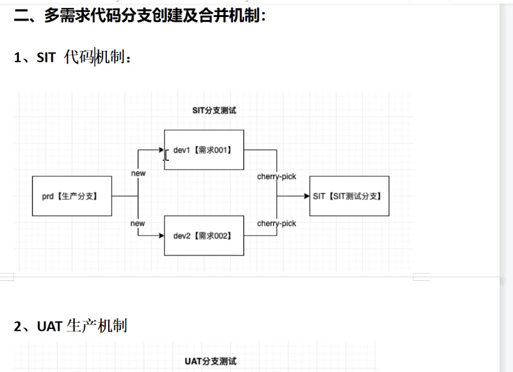
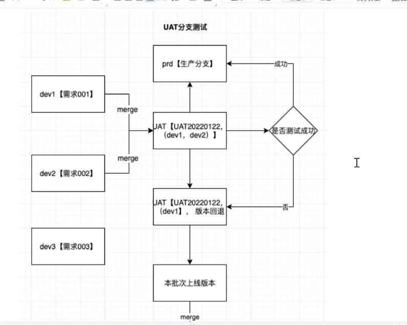
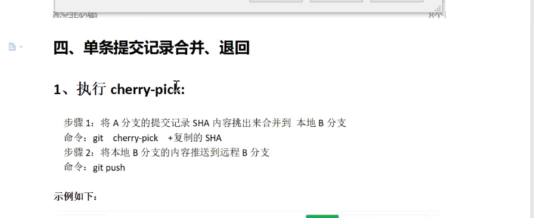

# git使用指南

[toc]


## git文件的三种状态

1. 已提交（committed）

   已经保存在本地数据库中

2. 已修改（modified）

   已经修改了文件，但还没保存到数据库中

3. 已暂存（staged）

   对一个已修改的文件的当前版本做了标记，使之包含在下次提交的快照中

## git项目的三个工作区域


1. 工作目录 （working）

   包含你需要进行版本控制的文件

2. 暂存区域（staged）

   保存下次将提交的文件列表信息

3. 仓库目录（repository）

### git基本的工作流程

1. 在工作目录中修改文件
2. 暂存文件，将文件的快照放入暂存区域
3. 提交更新，找到暂存区域的文件，将快照永久性存储到git仓库目录


## 初次使用git前的配置

git维护了多个配置文件，包括全局的配置文件和当前git项目下的配置文件

git的全局配置文件在`$HOME`目录下，可以在git命令行客户端下通过如下命令查看`$HOME`地址

```bash
echo $HOME
```

### 配置全局信息

```bash
git config --global user.name "propersilmon"
git config --global user.email "propersilmon@gmail.com"
```

### 检查全局配置信息

```bash
git config --list
```

**检查单项配置**

```bash
git config user.name
propersilmon
```


## 基础内容

主要内容有

1. 配置并初始化一个仓库
2. 开始或停止跟踪文件
3. 暂存文件
4. 提交更改
5. 配置git忽略指定文件和文件模式
6. 撤销错误操作
7. 浏览项目历史版本和不同提交间的差异
8. 向远程仓库推送（push）
9. 从远程仓库拉取文件（pull)

### 获取git仓库

1. 在现有目录下创建git仓库

   ```bash
   git init
   ```

2. 克隆现有的仓库

   git克隆能拉取远程仓库中的每一个文件每一个版本

   ```bash
   git clone https://github.com/libgit2/libgit2
   ```

   在克隆远程仓库时，自定义本地仓库名称

   ```bash
   git clone https://github.com/libgit2/libgit2 mylibgit
   ```


### 记录更新到仓库

#### git文件状态

1. 已跟踪
2. 未跟踪

#### 查看git文件状态

```bash
git status
```

#### git文件状态间的转换


#### 跟踪新文件（将文件修改加入暂存区）

使用`git add`命令来开始跟踪一个文件

```bash
git add 
```

#### 跟踪指定文件模式

**添加多个文件到暂存区**

```bash
git add [file] [file] ...
```

**添加指定目录到暂存区，包括子目录**

```bash
git add [dir]
```

**添加当前目录下的所有文件到暂存区**

```bash
git add .  
```

#### 跟踪暂存区里 被修改的文件 

暂存区中的文件被修改时，想要提交被修改后的文件，需要重新`git add`被修改的文件。

```bash
$ git status
On branch master
Changes to be committed:
  (use "git reset HEAD <file>..." to unstage)

    new file:   README

Changes not staged for commit:
  (use "git add <file>..." to update what will be committed)
  (use "git checkout -- <file>..." to discard changes in working directory)

    modified:   CONTRIBUTING.md
```

### 忽略文件

可以通过在项目中创建`.gitignore`文件来指定需要忽略的文件

文件 `.gitignore` 的格式规范如下：

- 所有空行或者以 `＃` 开头的行都会被 Git 忽略。
- 可以使用标准的 glob 模式匹配。
- 匹配模式可以以（`/`）开头防止递归。
- 匹配模式可以以（`/`）结尾指定目录。
- 要忽略指定模式以外的文件或目录，可以在模式前加上惊叹号（`!`）取反。

***glob模式***

星号（`*`）匹配零个或多个任意字符；`[abc]` 匹配任何一个列在方括号中的字符（这个例子要么匹配一个 a，要么匹配一个 b，要么匹配一个 c）；问号（`?`）只匹配一个任意字符；如果在方括号中使用短划线分隔两个字符，表示所有在这两个字符范围内的都可以匹配（比如 `[0-9]` 表示匹配所有 0 到 9 的数字）。 使用两个星号（`*`) 表示匹配任意中间目录，比如`a/**/z` 可以匹配 `a/z`, `a/b/z` 或 `a/b/c/z`等。

```bash
# no .a files
*.a

# but do track lib.a, even though you're ignoring .a files above
!lib.a

# only ignore the TODO file in the current directory, not subdir/TODO
/TODO

# ignore all files in the build/ directory
build/

# ignore doc/notes.txt, but not doc/server/arch.txt
doc/*.txt

# ignore all .pdf files in the doc/ directory
doc/**/*.pdf
```

### 提交更新

#### 提交暂存区中的文件

使用`git commmit`命令来提交更新

```bash
git commit
```

使用不加参数的命令会启动文本编辑器来让你输入本次提交的说明

你也可以在commit命令后添加`-m`参数来将提交信息与命令放在同一行，如下所示：

```bash
$ git commit -m "Story 182: Fix benchmarks for speed"
[master 463dc4f] Story 182: Fix benchmarks for speed
 2 files changed, 2 insertions(+)
 create mode 100644 README
```

#### 跳过暂存区提交

给`git commit`加上`-a`参数，git会自动把所有已经跟踪过的文件暂存起来并一并提交，从而跳过`git add`步骤：

```bash
$ git status
On branch master
Changes not staged for commit:
  (use "git add <file>..." to update what will be committed)
  (use "git checkout -- <file>..." to discard changes in working directory)

    modified:   CONTRIBUTING.md

no changes added to commit (use "git add" and/or "git commit -a")
$ git commit -a -m 'added new benchmarks'
[master 83e38c7] added new benchmarks
 1 file changed, 5 insertions(+), 0 deletions(-)
```

### 修改文件状态（已跟踪——>未跟踪）

使用`git rm`命令将文件从已跟踪文件清单中移除，并在当前的工作目录中删除该文件。

**注意：**该操作会删除当前文件

```bash
$ git rm PROJECTS.md
rm 'PROJECTS.md'
$ git status
On branch master
Changes to be committed:
  (use "git reset HEAD <file>..." to unstage)

    deleted:    PROJECTS.md
```

只把文件从暂存区中删除，但仍然保留在当前工作目录中，使用`git rm --cached`

```bash
git rm --cached README
```

`git rm`也可以通过 `glob`模式指定删除的文件模式

```bash
$ git rm log/\*.log   # 删除log/目录下扩展名为.log的所有文件
$ git rm \*~		 # 删除以~结尾的所有文件 
```

### 重命名文件

当修改文件命名时，需要移除暂存区中跟踪的旧文件，重新跟踪重命名后的新文件

```bash
$ mv README.md README
$ git rm README.md
$ git add README
```

以上三步命令可以使用一步`git mv`命令来完成

```bash
$ git mv README.md README
$ git status
On branch master
Changes to be committed:
  (use "git reset HEAD <file>..." to unstage)

    renamed:    README.md -> README
```

### 查看提交历史

使用`git log`命令来查看提交历史

```bash
$ git log
commit ca82a6dff817ec66f44342007202690a93763949
Author: Scott Chacon <schacon@gee-mail.com>
Date:   Mon Mar 17 21:52:11 2008 -0700

    changed the version number

commit 085bb3bcb608e1e8451d4b2432f8ecbe6306e7e7
Author: Scott Chacon <schacon@gee-mail.com>
Date:   Sat Mar 15 16:40:33 2008 -0700

    removed unnecessary test

commit a11bef06a3f659402fe7563abf99ad00de2209e6
Author: Scott Chacon <schacon@gee-mail.com>
Date:   Sat Mar 15 10:31:28 2008 -0700

    first commit
```

**常用参数**

- **-p**

  显示每次提交的内容差异，可以加上`-[number]`来显示最近的`number`次提交。

  ```bash
  $ git log -p -2
  commit ca82a6dff817ec66f44342007202690a93763949
  Author: Scott Chacon <schacon@gee-mail.com>
  Date:   Mon Mar 17 21:52:11 2008 -0700
  
      changed the version number
  
  diff --git a/Rakefile b/Rakefile
  index a874b73..8f94139 100644
  --- a/Rakefile
  +++ b/Rakefile
  @@ -5,7 +5,7 @@ require 'rake/gempackagetask'
   spec = Gem::Specification.new do |s|
       s.platform  =   Gem::Platform::RUBY
       s.name      =   "simplegit"
  -    s.version   =   "0.1.0"
  +    s.version   =   "0.1.1"
       s.author    =   "Scott Chacon"
       s.email     =   "schacon@gee-mail.com"
       s.summary   =   "A simple gem for using Git in Ruby code."
  
  commit 085bb3bcb608e1e8451d4b2432f8ecbe6306e7e7
  Author: Scott Chacon <schacon@gee-mail.com>
  Date:   Sat Mar 15 16:40:33 2008 -0700
  
      removed unnecessary test
  
  diff --git a/lib/simplegit.rb b/lib/simplegit.rb
  index a0a60ae..47c6340 100644
  --- a/lib/simplegit.rb
  +++ b/lib/simplegit.rb
  @@ -18,8 +18,3 @@ class SimpleGit
       end
  
   end
  -
  -if $0 == __FILE__
  -  git = SimpleGit.new
  -  puts git.show
  -end
  \ No newline at end of file
  ```

- `--stat`

  显示每次提交的简略信息

  ```bash
  $ git log --stat
  commit ca82a6dff817ec66f44342007202690a93763949
  Author: Scott Chacon <schacon@gee-mail.com>
  Date:   Mon Mar 17 21:52:11 2008 -0700
  
      changed the version number
  
   Rakefile | 2 +-
   1 file changed, 1 insertion(+), 1 deletion(-)
  
  commit 085bb3bcb608e1e8451d4b2432f8ecbe6306e7e7
  Author: Scott Chacon <schacon@gee-mail.com>
  Date:   Sat Mar 15 16:40:33 2008 -0700
  
      removed unnecessary test
  
   lib/simplegit.rb | 5 -----
   1 file changed, 5 deletions(-)
  
  commit a11bef06a3f659402fe7563abf99ad00de2209e6
  Author: Scott Chacon <schacon@gee-mail.com>
  Date:   Sat Mar 15 10:31:28 2008 -0700
  
      first commit
  
   README           |  6 ++++++
   Rakefile         | 23 +++++++++++++++++++++++
   lib/simplegit.rb | 25 +++++++++++++++++++++++++
   3 files changed, 54 insertions(+)
  ```

- `--pretty`

  指定使用不同默认格式的方式展示提交历史，可用模式有`oneline`,`short`,`full`,`fuller`

  ```bash
  $ git log --pretty=oneline
  ca82a6dff817ec66f44342007202690a93763949 changed the version number
  085bb3bcb608e1e8451d4b2432f8ecbe6306e7e7 removed unnecessary test
  a11bef06a3f659402fe7563abf99ad00de2209e6 first commit
  ```

  还可以使用`format`来定制要显示的记录格式

  ```bash
  $ git log --pretty=format:"%h - %an, %ar : %s"
  ca82a6d - Scott Chacon, 6 years ago : changed the version number
  085bb3b - Scott Chacon, 6 years ago : removed unnecessary test
  a11bef0 - Scott Chacon, 6 years ago : first commit
  ```

  **`git  log –-pretty=format`常用的选项**

  | 选项  | 说明                                        |
  | ----- | ------------------------------------------- |
  | `%H`  | 提交对象（commit）的完整哈希字串            |
  | `%h`  | 提交对象的简短哈希字串                      |
  | `%T`  | 树对象（tree）的完整哈希字串                |
  | `%t`  | 树对象的简短哈希字串                        |
  | `%P`  | 父对象（parent）的完整哈希字串              |
  | `%p`  | 父对象的简短哈希字串                        |
  | `%an` | 作者（author）的名字                        |
  | `%ae` | 作者的电子邮件地址                          |
  | `%ad` | 作者修订日期（可以用 --date= 选项定制格式） |
  | `%ar` | 作者修订日期，按多久以前的方式显示          |
  | `%cn` | 提交者（committer）的名字                   |
  | `%ce` | 提交者的电子邮件地址                        |
  | `%cd` | 提交日期                                    |
  | `%cr` | 提交日期，按多久以前的方式显示              |
  | `%s`  | 提交说明                                    |

- `--graph`

  使用`ASCII`字符串分支来形象地展示分支、合并历史

  ```bash
  $ git log --pretty=format:"%h %s" --graph
  * 2d3acf9 ignore errors from SIGCHLD on trap
  *  5e3ee11 Merge branch 'master' of git://github.com/dustin/grit
  |\
  | * 420eac9 Added a method for getting the current branch.
  * | 30e367c timeout code and tests
  * | 5a09431 add timeout protection to grit
  * | e1193f8 support for heads with slashes in them
  |/
  * d6016bc require time for xmlschema
  *  11d191e Merge branch 'defunkt' into local
  ```

  

**`git log`的常用选项**

| 选项              | 说明                                                         |
| ----------------- | ------------------------------------------------------------ |
| `-p`              | 按补丁格式显示每个更新之间的差异。                           |
| `--stat`          | 显示每次更新的文件修改统计信息。                             |
| `--shortstat`     | 只显示 --stat 中最后的行数修改添加移除统计。                 |
| `--name-only`     | 仅在提交信息后显示已修改的文件清单。                         |
| `--name-status`   | 显示新增、修改、删除的文件清单。                             |
| `--abbrev-commit` | 仅显示 SHA-1 的前几个字符，而非所有的 40 个字符。            |
| `--relative-date` | 使用较短的相对时间显示（比如，“2 weeks ago”）。              |
| `--graph`         | 显示 ASCII 图形表示的分支合并历史。                          |
| `--pretty`        | 使用其他格式显示历史提交信息。可用的选项包括 oneline，short，full，fuller 和 format（后跟指定格式）。 |

**限制`git log`输出**

- `-S`

  列出那些添加或移除了某些字符串的提交。 比如说，你想找出添加或移除了某一个特定函数的引用的提交，你可以这样使用：

  ```bash
  $ git log -Sfunction_name
  ```

- `–-since`

  仅显示指定时间之后的提交。

  ```bash
  $ git log --since=2.weeks
  ```

  列出所有最近两周内的提交。

限制`git log`输出的选项

| 选项                  | 说明                               |
| --------------------- | ---------------------------------- |
| `-(n)`                | 仅显示最近的 n 条提交              |
| `--since`, `--after`  | 仅显示指定时间之后的提交。         |
| `--until`, `--before` | 仅显示指定时间之前的提交。         |
| `--author`            | 仅显示指定作者相关的提交。         |
| `--committer`         | 仅显示指定提交者相关的提交。       |
| `--grep`              | 仅显示含指定关键字的提交           |
| `-S`                  | 仅显示添加或移除了某个关键字的提交 |


## 项目实际的分支管理机制

### 分支合并机制





> 问题：如何发版


### SIT合并机机制（单条提交记录合并、退回）



挑拣合并，及是将某一个分支的部分提交合并到另一个分支上

具体步骤是先切换到你的要使用的分支上

然后在该分支上使用`git cherry-pick命令`

如果挑拣的需求和主分支上有冲突的话，需要解决冲突

之后在push一下

如果被挑拣的分支上因为有冲突进行了修改，则可以回到被挑拣的分支上，将版本回退回来。